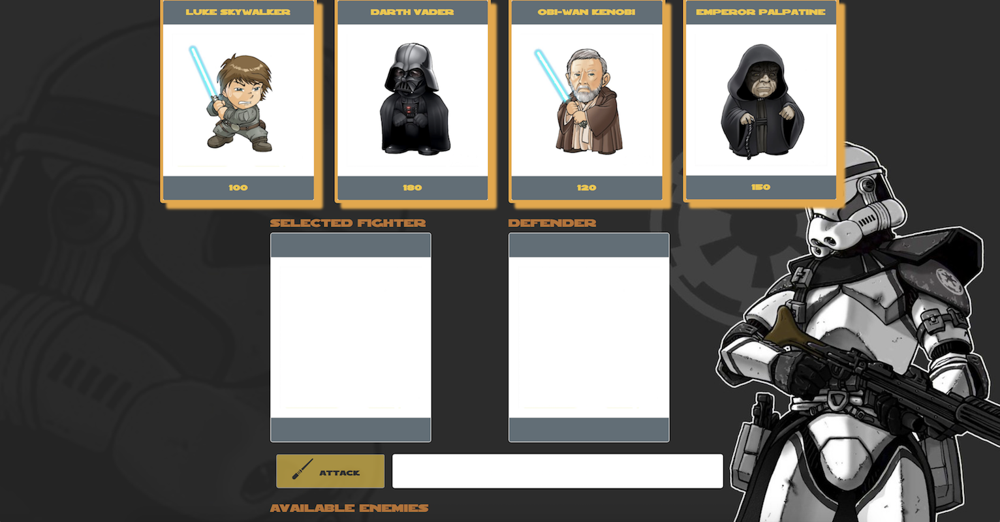

# Star Wars Based RPG Game

## What Is It?
An HTML based Star Wars themed RPG game.

## How Does The Game Work?
1. Here are the rules of the game:
   * When the game starts, choose a character by clicking on the fighter's picture. You will fight as that character for the rest of the game.

   * You must then defeat all of the remaining fighters. 

   * Choose an opponent by clicking on an enemy's picture.

   * Once you have selected an opponent, that enemy is moved to the `defender area`.
   
   * When you click on `attack`, your character will inflict damage on the defender. The opponent will lose `HP` (health points). These points are displayed at the bottom of the defender's picture. 
     
    * The opponent character will instantly counter the attack. When that happens, your character will lose some of their `HP`. These points are shown at the bottom of your character's picture.

3. Keep hitting the attack button in an effort to defeat your opponent.

   * When the defender's `HP` is reduced to zero or below, you can choose a new opponent.

4. You win the game by defeating all enemy characters. You will lose the game the game if your character's `HP` falls to zero or below.

## Under the Hood
This game was created using HTML/CSS/JavaScript and JQuery. 
